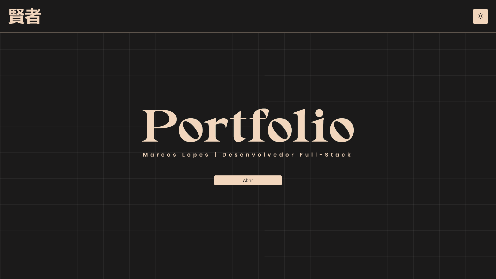

# Digital Portfolio

> My digital portfolio, created with Vue.js, highlights my most important projects.
>
> Site: [Portfolio](https://marcos-lopes-portfolio.vercel.app)

### Adjustments and improvements

The project is still under development and the next updates will focus on the following tasks:

- [ ] Add favicon
- [ ] Add image to footer banner
- [ ] Leave the header with a defined height and no button